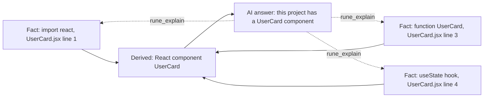
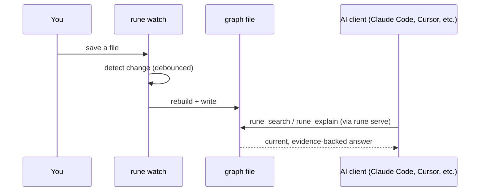

# Rune

**The Software Intelligence Runtime.**

Cursor, Codex, Claude Code — they all read your codebase cold, every session, and forget everything when it ends. Rune is the thing that runs underneath them, continuously, so every session starts already knowing your codebase instead of re-deriving it.

**Without Rune:** every new AI session reads your files cold, reasons and answers, then forgets everything when the session ends — the next session starts back at zero.

**With Rune:** `rune watch` keeps an understanding graph current in the background as you edit. Every new AI session queries that graph over MCP instead of re-reading files cold, and gets an evidence-backed answer cited to file + line.


**[What it does](#what-rune-does) · [How it works](#how-it-works) · [Install](#install) · [Quickstart](#quickstart) · [See real output](#what-this-actually-looks-like) · [CLI](#cli) · [MCP tools](#mcp-tools-exposed) · [Limitations](#current-scope-and-honest-limitations) · [Security](#security-notes)**

---

## What Rune does

- **Always current** — `rune watch` keeps the understanding graph up to date as you edit, not just when someone remembers to re-run a scan. It's a runtime, not a one-shot CLI.
- **Persistent** — understanding survives past any single session. Every AI you connect starts already knowing your software, instead of re-reading it cold.
- **Shared** — one understanding, many AI clients. Claude, GPT, Gemini, whatever you're running next month — they all ask the same Rune instance instead of maintaining separate, inconsistent mental models of your code.
- **Explainable** — nothing Rune tells an AI is a black box. Ask it to justify any claim and it shows the exact source location behind it.
- **Read-only, suggest-only** — Rune never writes to your source. That's the actual moat: everything else in this space is racing toward autonomous code-writing; Rune stays strictly on the reading, understanding, and (later) suggesting side of that line. It never becomes the thing you have to double-check for silently breaking your code.

## How it works

Two layers, and every conclusion traces back to evidence — not asserted, always inspectable:



Call `rune explain <id>` (or the `rune_explain` MCP tool) on anything and get that chain back. An AI using Rune isn't guessing about your architecture — and neither is Rune.

## Install

```bash
npm install @pypl100/rune
```

*A Python distribution exists at [`python/`](python/) with full feature parity (same fact/derived model, same detectors, same MCP tool surface) for teams who'd rather not require Node.js — published as `pip install north-rune` (the CLI command is still `rune`; see [python/README.md](python/README.md)).*

> **If you install both** (`@pypl100/rune` via npm globally, and `north-rune` via pip) on the same machine, only one `rune` command will actually be on your `PATH` — whichever your shell finds first, not whichever you installed most recently. Check with `which -a rune`; if it lists more than one path, that's why. There's no version-detection magic here — it's plain OS `PATH` resolution, same as any two unrelated tools that happen to install a same-named binary. If you need a specific one, invoke it by its full path rather than relying on bare `rune`.

## Quickstart

```bash
cd your-project
npm install -g @pypl100/rune   # or: npx -p @pypl100/rune rune <command>
rune init      # sets up Rune in your project
rune watch &    # keeps the understanding current in the background as you work
rune serve      # starts an MCP server exposing it to any AI client
```

`rune watch` is the recommended default — it's what makes Rune a runtime instead of a tool you have to remember to re-run. (For CI or a one-shot check, use `rune scan` instead.)



Point any MCP-compatible client (Claude Desktop, Claude Code, custom agents, etc.) at the `rune serve` process. Every connected AI shares the same, continuously current understanding — no restart, no manual rescan.

Example MCP client config entry:

```json
{
  "mcpServers": {
    "rune": {
      "command": "npx",
      "args": ["-p", "@pypl100/rune", "rune", "serve", "/absolute/path/to/your-project"]
    }
  }
}
```

## What this actually looks like

Real output, from the fixture project in this repo — not staged:

```
$ rune scan .
[rune] scanned 4 file(s) in 34ms
[rune] facts: 10, derived conclusions: 4
[rune] graph written to /project/.rune/graph.json

$ rune explain component_2
{
  "kind": "function",
  "id": "component_2",
  "type": "react_component",
  "file": "components/UserCard.jsx",
  "line": 3,
  "name": "UserCard",
  "evidence": "export function UserCard({ user }) {"
}
```

That's the whole trust model in one example: Rune doesn't just say "there's a `UserCard` component" — it points at the exact file, the exact line, and the exact text it matched. Ask it to explain anything, and you get the receipts, not a claim.

## CLI

| Command | What it does |
|---|---|
| `rune init [dir]` | Sets up `.rune/` in the current (or given) project |
| `rune scan [dir]` | Builds (or rebuilds) the understanding graph, once |
| `rune watch [dir]` | Keeps the understanding graph current as files change (Ctrl+C to stop) |
| `rune serve [dir]` | Starts the MCP server |
| `rune explain <id>` | Prints the evidence trail behind any fact or conclusion |
| `rune --version` | Prints the installed Rune version |

## Configuration

`rune init` writes `.rune/config.json`. The only setting today is `ignore` — an array of directory/file names to exclude from scanning, on top of the built-in defaults (`node_modules`, `.git`, `dist`, `build`, `.next`, `coverage`, etc., and all dotfiles unconditionally):

```json
{
  "ignore": ["legacy", "vendor"],
  "version": 1
}
```

## MCP tools exposed

| Tool | Purpose |
|---|---|
| `rune_get_overview` | Architecture summary — start here |
| `rune_list_components` | All detected React components |
| `rune_list_routes` | Unified Express + Next.js route list |
| `rune_search` | Find facts/derived nodes by name, file, or route substring |
| `rune_explain` | Full evidence trail for any id |
| `rune_get_file_dependencies` | Internal import graph for a file |
| `rune_rescan` | Re-scan on demand after code changes |

## Current scope and honest limitations

Rune is intentionally narrow right now:

- **Framework support:** React, Next.js (pages + app router), Express. Everything else gets generic file/import scanning only.
- **Extraction method:** heuristic, regex-based pattern matching — not a full AST parser. This keeps the scanner dependency-free and fast, and every fact still carries file/line/matched-text evidence, but it will miss unusual code shapes (e.g. components returned via `React.createElement` with no JSX, dynamically constructed route strings, deeply re-exported components). A real AST-based extractor is the natural next upgrade — the fact schema is designed so extraction method can be swapped without touching anything downstream.
- **No cross-file route-prefix resolution:** an Express route mounted via `app.use('/api', router)` in one file and defined in another isn't stitched into a single path yet.
- **Read-only:** Rune never writes to your source files. It only ever writes its own graph to `.rune/graph.json`.
- **Single-process, stdio MCP transport** — no multi-client daemon yet.

## Security notes

- Rune **never scans dotfiles or dot-directories** (`.env`, `.env.*.js`, `.git`, `.ssh`, editor configs, etc.), with no exceptions. This is enforced in the scanner and covered by a regression test — a config file with a matching code extension (e.g. `.env.js`) will not have its contents read or embedded as evidence.
- Symlinks are not traversed, so a symlink pointing outside the project root can't pull external files into the scan.
- `.rune/graph.json` is excluded from git by `rune init` (it creates `.gitignore` if one doesn't already exist).
- The graph itself is the only thing Rune writes. If you share `.rune/graph.json` with an AI client, you're sharing everything in it — treat it like any other file that quotes snippets of your source.

## Verifying the MCP server

The unit test suite (`npm test`) covers scanning and the understanding graph, but doesn't spin up a real MCP client. `scripts/verify-mcp-server.mjs` does: it spawns `rune serve` as a real child process and drives it through the actual JSON-RPC handshake (`initialize` → `notifications/initialized` → `tools/list` → `tools/call`), checks that all expected tools are exposed, and confirms a genuinely invalid call is rejected cleanly rather than crashing the server.

```bash
npm install
npm run verify:mcp
# or against a real project instead of the bundled fixture:
npm run verify:mcp -- /path/to/your-project
```

## Roadmap

- AST-based extraction (swap-in replacement for the regex scanner)
- Cross-file route resolution
- Data-flow tracing between frontend calls and backend routes
- True incremental re-scan — `rune watch` exists now, but it still does a full rebuild on every change, not a diff of just what changed. Fine for small-to-medium projects; will matter on very large ones.
- Suggestion tools (e.g. flagging a known-vulnerable dependency pattern with evidence, proposing a reviewable fix) — strictly additive to the read-only model, never auto-applied

## License

MIT

---

If you want to support the circus: ETH `0xbc0979dde621c353737d21f6d7b4eb361f7bc11f`
